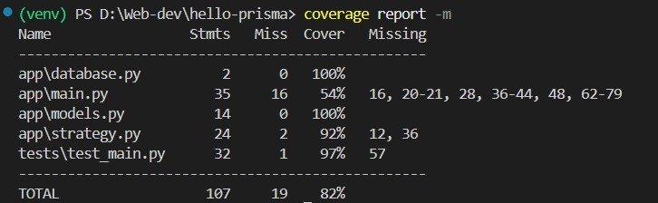
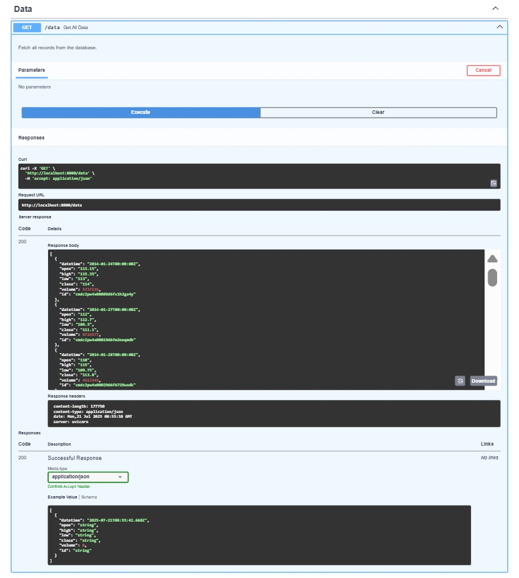
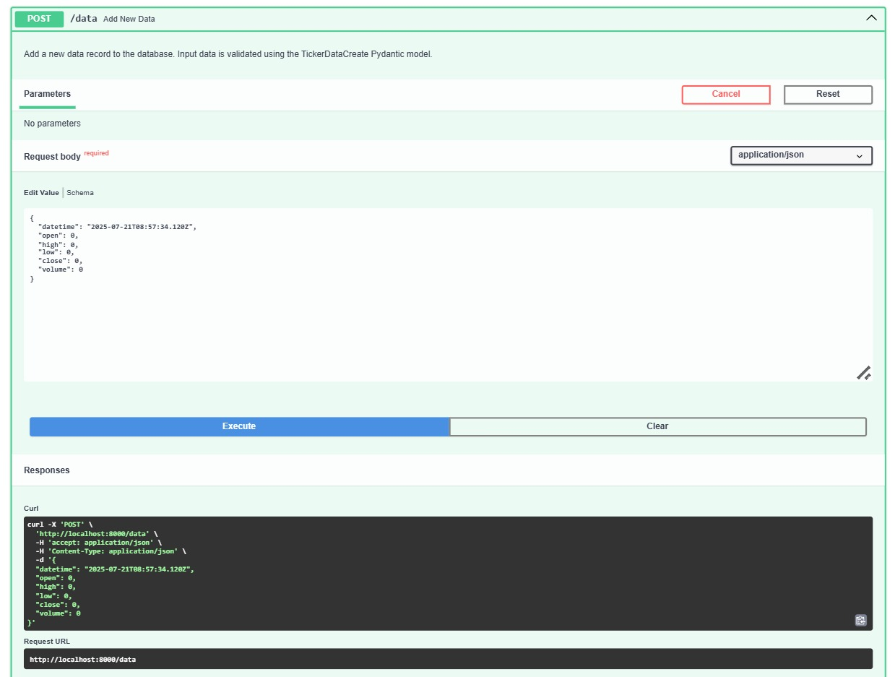
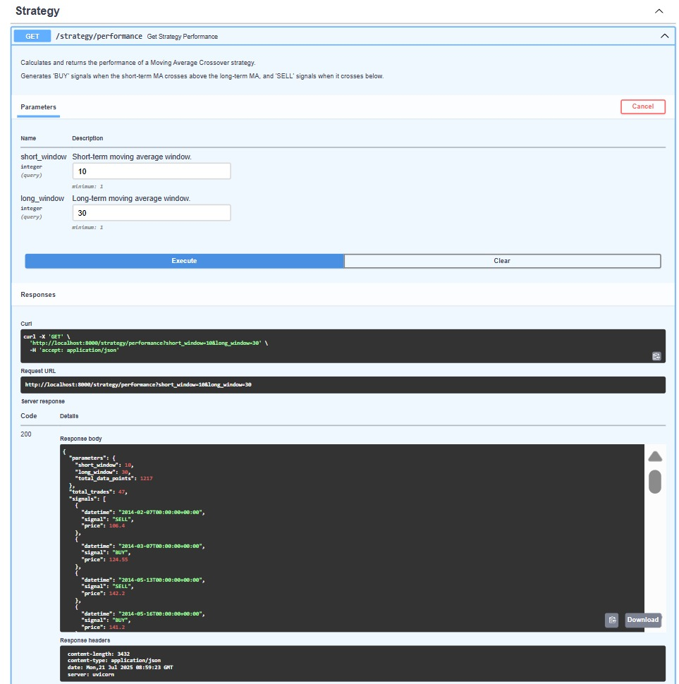

# Algorithmic Trading Strategy Backtester

This project is a comprehensive, containerized backend service built with Python, FastAPI, and Docker. It provides a RESTful API to store, manage, and analyze time-series financial data, and includes an implementation of a Simple Moving Average (SMA) Crossover trading strategy.

## Core Features

-   **Robust API**: A RESTful API built with **FastAPI** for high performance, including automatically generated interactive documentation.
-   **Database Management**: Utilizes a **PostgreSQL** database to store and retrieve thousands of financial data points.
-   **Modern ORM**: Leverages **Prisma ORM** for type-safe database access, schema definition, and migrations.
-   **Algorithmic Strategy**: Implements a moving average crossover trading strategy using the **Pandas** library to generate buy/sell signals based on historical data.
-   **Containerized Environment**: The entire application stack (API + Database) is fully containerized using **Docker** and orchestrated with **Docker Compose** for easy setup and consistent, reproducible environments.
-   **Unit Tested**: Includes a suite of unit tests written with Python's `unittest` framework, achieving **over 80% code coverage** to ensure application reliability and correctness.

## Technology Stack

-   **Backend**: Python, FastAPI
-   **Database**: PostgreSQL
-   **ORM**: Prisma Client Python
-   **Data Analysis**: Pandas, NumPy
-   **Containerization**: Docker, Docker Compose
-   **Testing**: unittest, FastAPI TestClient, Coverage.py

## Setup and Installation

To run this project locally, you need to have **Docker** and **Docker Compose** installed.

Use Docker Compose to build the images and start all services.
docker-compose up --build

The database starts empty. To set up the schema and load the data, you must run commands inside the running API container.
# Command to apply the database schema
docker-compose exec api prisma migrate dev --name init

# Command to load the financial data from data.csv into the database
docker-compose exec api python load_data.py

The interactive API documentation is available at http://localhost:8000/docs after starting the application.
GET /data: Fetches all ticker records from the database.
POST /data: Adds a new ticker record to the database. The request body must conform to the TickerDataCreate model.
GET /strategy/performance: Executes the Moving Average Crossover strategy on the stored data and returns the generated signals.
Query Parameters:
short_window (int, default: 10)
long_window (int, default: 30)

Test Coverage Report
The project meets the >80% test coverage requirement.

GET /data Endpoint
Fetching all records successfully.

POST /data Endpoint
Creating a new record successfully.

GET /strategy/performance Endpoint
The strategy endpoint returning generated BUY/SELL signals.

To run the unit tests and generate a coverage report locally, first ensure you have the requirements.txt installed in a Python virtual environment.

# 1. (If not done) Create and activate a virtual environment
# python -m venv venv
# source venv/bin/activate  # On MacOS/Linux
# .\venv\Scripts\Activate.ps1 # On Windows PowerShell

# 2. Install dependencies
# pip install -r requirements.txt

# 3. Run tests with coverage
coverage run -m unittest discover -s tests

# 4. View the coverage report
coverage report -m
